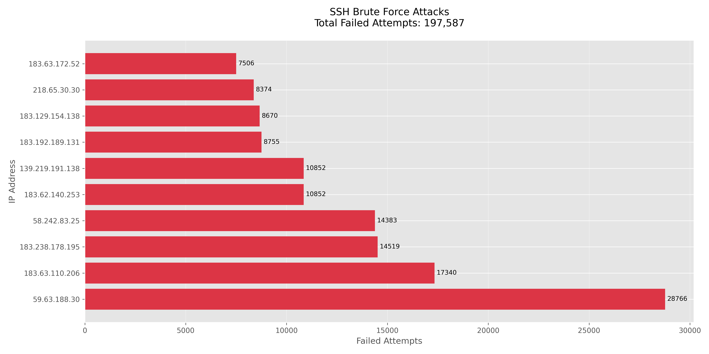

# 🔐 SSH Security Log Analyzer

  
A Python-powered tool to analyze OpenSSH logs, detect brute-force login attempts, and trigger email alerts with insightful visual reports.

✨ Features

**📊 Attack Analytics**:  
  Parses OpenSSH logs and identifies failed login attempts and top attacking IPs.

**🚨 Alert System**:  
  Sends email alerts for suspicious IPs exceeding a configurable threshold.

**📈 Visual Reporting**:  
  Generates bar charts (`ssh_attackers.png`) showing top IPs based on failed attempts.

**🔧 Customizable**:
  - Adjustable sensitivity thresholds
  - Environment-based credential config
  - Plug-and-play with any `.log` file


## 🚀 Getting Started

### Prerequisites
- Python 3.8+
- Gmail account (for alerts)

#### Install Dependencies

```bash
pip install matplotlib